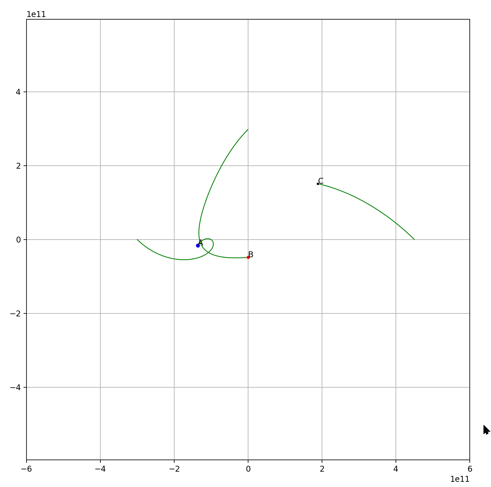

# Simulate Solar Orbit in Python

The repo includes three implementations of simulation.

1. File `solar_orbit_2d.py` plot the 2d orbit with Matplotlib

1. File `solar_orbit_3d_plt.py` plot the 3d orbit with Matplotlib3d

1. File 'solar_orbit_3d_ipyvolume.py' plot 3d orbit with [ipyvolume](https://ipyvolume.readthedocs.io/en/latest/index.html)

1. File 'three_body.py' simulate a three body orbit
